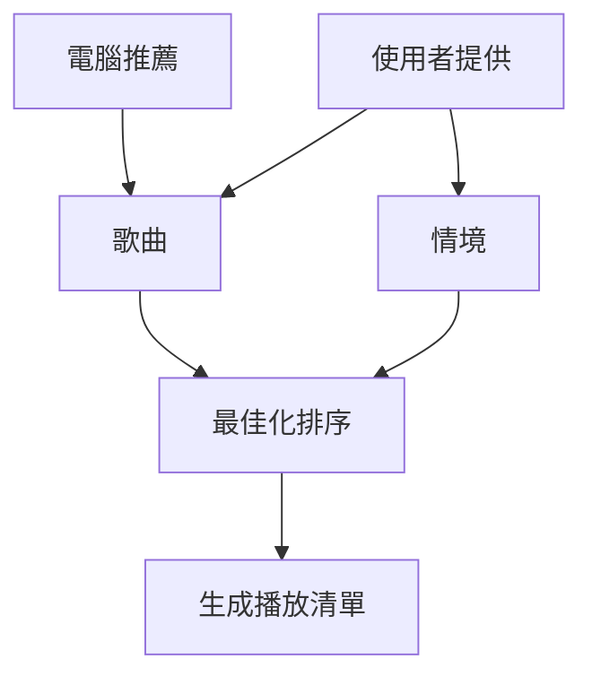
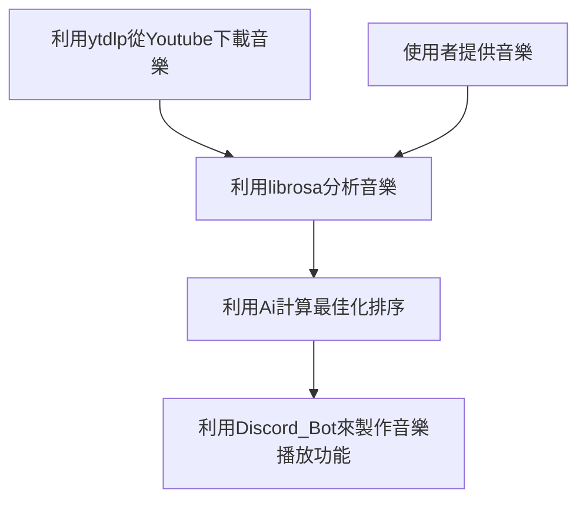
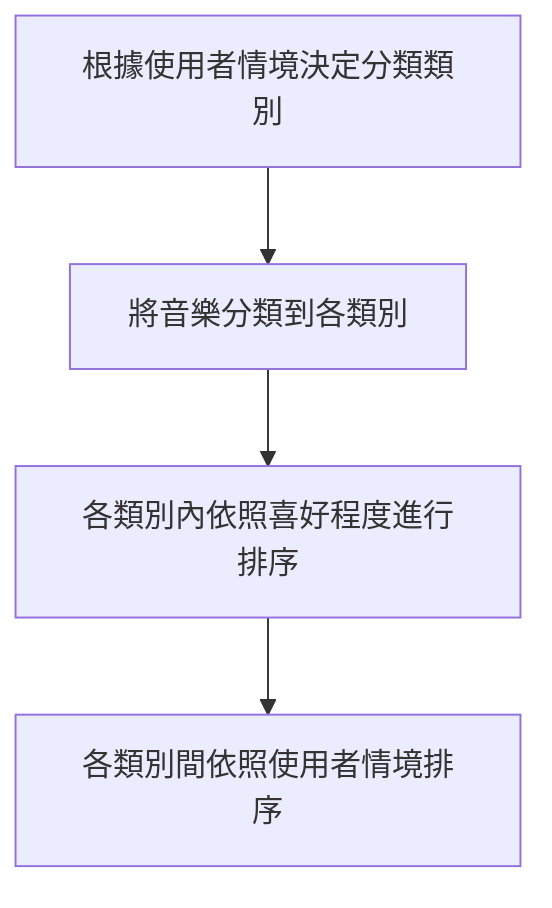
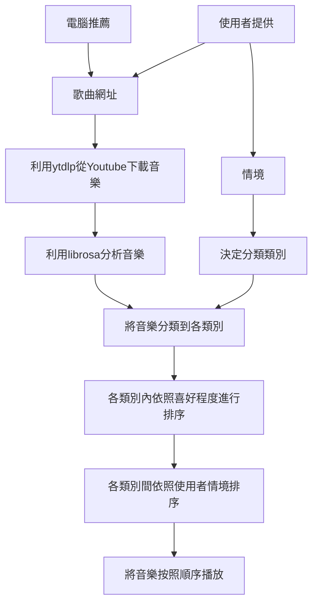

# YTP_project_MusicBot

## Info
YTP 第七屆專題競賽

組名：Grantiger

成員：蔡兆豐、陳俊邑、林子睿

就讀學校：台中一中

指導老師：師大科技系蔡芸琤老師

指導業師：精誠科技講師

## Schedule
| 周次|項目| 日期|
|:---:|:---:|:----:|
|1|GitHub & VSCode 開發環境安裝與設定|9/6|
|2|[Web Scrapying](https://hackmd.io/@tyrso/S1wr2T4xs)|9/13|
|3|[Machine learning](https://github.com/kennychenfs/YTP-2022/blob/main/Week%203:%20ML.md) & [OOP](https://github.com/kennychenfs/YTP-2022/blob/main/Week%203:%20OOP.md)|9/20|
|4|[Machine learning](https://hackmd.io/@im72_DVuSzmn6EaVL1SDmQ/BJDOHPBWo)|9/27|
|5|[Natural Language Processing](https://hackmd.io/@q3F5smA6Re6SDm0uqgMogA/Sy8grJ8bo)|10/4|
|6|Natural Language Processing|10/18|
|7|[Deep Learning](https://hackmd.io/@K_BWZMWvQDSnp1ywD_ditQ/H1sPGQBQi)|10/18|
|8||10/25|
|9||11/1|

## 摘要

製作一個音樂處理的Discord機器人(或外掛軟體)，可以先對音樂進行分類，然後再根據勾選的內容生成一個播放清單，最後根據之前喜好進行最佳化排序。最後目的是達成可以生成所需特徵最佳的播放清單。

## 動機

最近在讀書的時候想要找一些音樂合輯，但我們發現網路上可以找到的音樂合輯總是會有一些不太喜歡的地方，讓專心的狀態被打斷，所以我們就想要自己生成一個自己喜歡的清單，可以根據自己的喜歡的歌曲和現在的心情決定一個順序來撥放歌曲，幫助自己的工作效率提高。

## 流程圖

### 功能

### 音樂處理

### 最佳化排序法

### 總結

